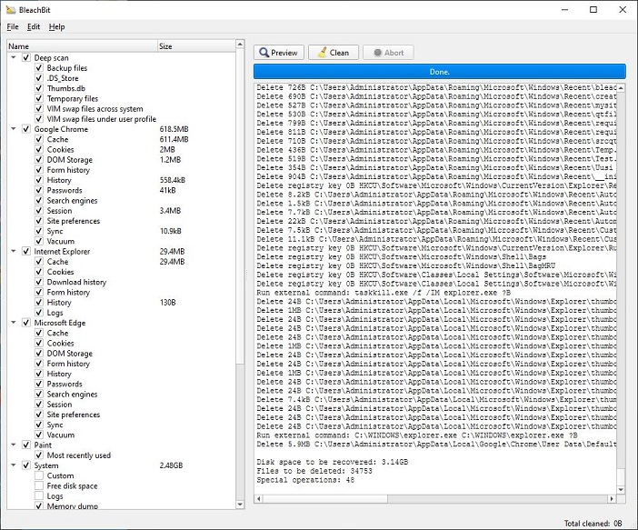
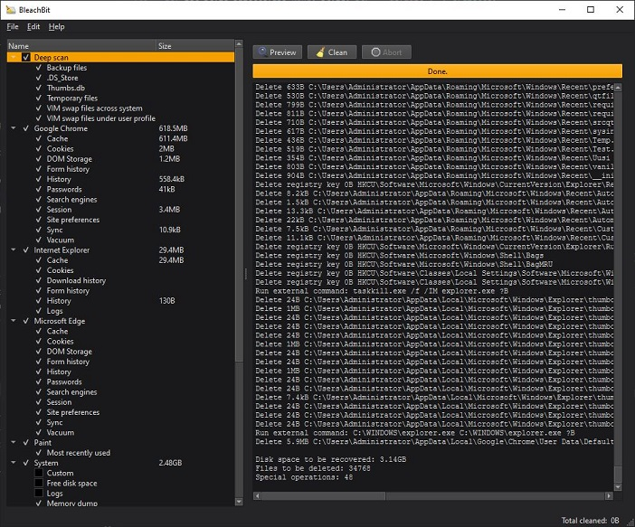
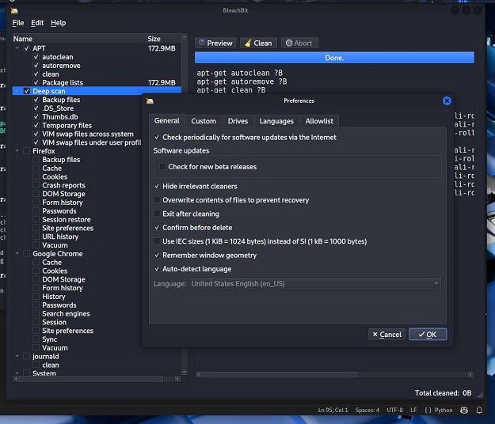
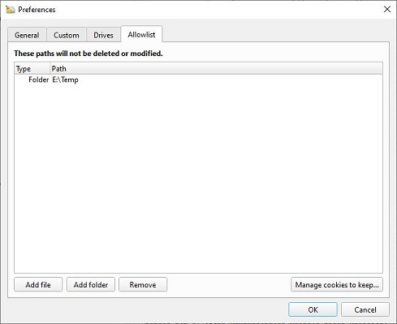
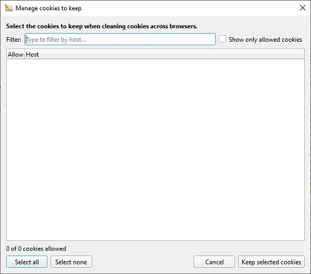
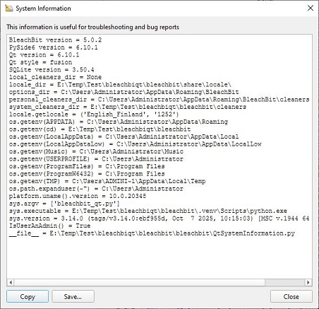
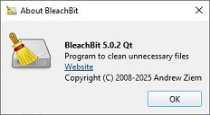

# BleachBit Qt User Interface (PySide6)

This document describes the **Qt / PySide6 user interface port** of BleachBit.

The Qt UI is implemented **in parallel** with the existing GTK UI and reuses the **same backend, cleaners, and configuration files**, providing an alternative frontend based on the Qt toolkit.

## Running developer preview

The Qt UI is an experimental version, it can only be run from source at the moment. Script (prepare.bat or prepere.sh) is provided for Windows and for Linux (like system) users to ease test setup.

Script will:
* Clone the bleachbit repo
* Copy source files and directories (from srcqt/) needed to run the software
* Create Python virtual environment (venv) not to mess system Python installations (venv is created to bleachbit/venv)
* Activate the venv
* Install Python requirements (using pip)

Regarding to the previous, **prerequisites** are as follows and need to be accessible from the shell:
* Python 3 (version suitable to be able to install and use PySide6) + pip
* Git

**Setup**:

```
git clone https://github.com/Juhani-R/BleachBit-Qt.git
cd BleachBit-Qt
```

* Windows (cmd): 
```
prepare.bat
```

* Linux (shell): 
```
source prepare.sh
```

**Run BleachBit**:
```
python bleachbit_qt.py
```
Remember to reactivate the virtual environment (venv) if needed.

**Beware!** BleachBit Qt is an experimental software capable of altering the system and not yet ready for production use. Only expert use and testing recommended.

## Overview

The Qt UI port was created to:

* Provide a **native Qt-based interface** for users who prefer Qt
* Improve integration on platforms where Qt is more common
* Keep **full compatibility** with the existing BleachBit backend
* Avoid regressions by **not replacing** the GTK UI

Both UIs can coexist and share the same configuration, cleaners, and runtime behavior.

## Key Characteristics

* **Toolkit:** Qt 6 via PySide6
* **Backend:** Basically minor changes not affecting the GTK UI (shared with GTK UI)
* **Status:** Almost feature-complete with the GTK UI
* **Platforms:** Windows (runs and tested), Linux (runs, but not really tested), other OS' (expected)
* **Theme support:** Native light/dark themes via Qt. Theme implementation is rather naive proof of concept at the moment, just to demonstrate. Look for QtGUI.py for setting the theme at launch (can not be changed from the GUI at the moment).

## Architecture

The Qt UI is implemented as a **separate frontend layer**:

```
bleachbit_qt.py           → Qt entry point
bleachbit/
  QtGUI.py                → Main window (some drop-down menu features missing)
  QtGuiPreferences.py     → Preferences dialog
  QtGuiCookie.py          → Cookie manager
  QtGuiChaff.py           → Chaff generator (not ready yet)
  QtSystemInformation.py  → System information dialog
```

No backend logic was duplicated. Minor changes to existing BleachBit code base, which can be easily merged.

All cleaning, preview, options, and filesystem logic is reused as-is.

## Main Window

### Light theme (no theme)



### Dark theme (orange accent)



### Running on Linux (Kali)



## Preferences



## Cookie Manager



## System Information



## About Dialog




## Packaging & Distribution

The upcoming Qt UI packaging will be designed to operate independently from GTK.

## Coexistence with GTK UI

The Qt UI:

* Does **not** replace the GTK UI
* Uses the same configuration and data files
* Can be selected at launch time
* Allows gradual adoption and testing
* Can easily be submitted into official BleachBit project

The design minimizes risk of regression and maximizes maintainability.

## Status

* ✔ Main UI nearly complete 
* ✔ Preferences complete
* ✔ Cookie manager complete
* ✔ System information complete
* ✔ About dialog complete
*   Chaff generator not complete
* ✔ Localization works (mostly) and shares the same pipeline with GTK (main window needs a restart, some strings need to be updated etc.)
* ✔ Windows tested and mostly functional (needs expert testing)
*   No proper testing on other platforms (tested basic running on Kali Linux)

## Credits

BleachBit is Copyright © 2008–2025
Andrew Ziem and contributors
[https://www.bleachbit.org](https://www.bleachbit.org)

BleachBit Github development page: [https://github.com/bleachbit/bleachbit](https://github.com/bleachbit/bleachbit)

Initial Qt UI port implemented by Juhani-R using **PySide6** and the **Qt framework**.
